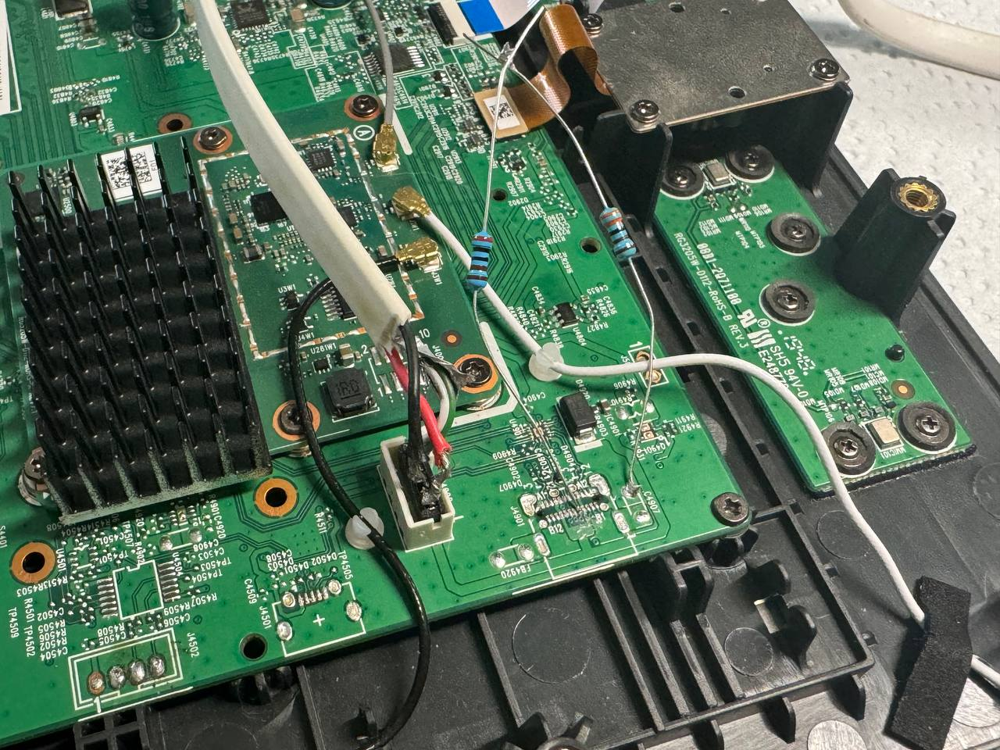
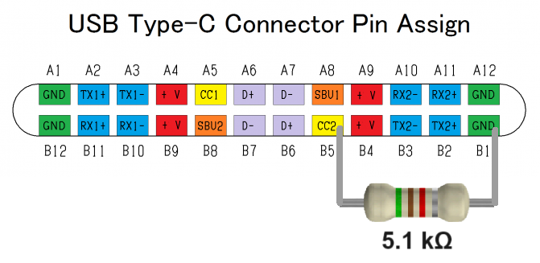

# Reutilización de Movistar Home

como un panel de dashboard para Home Assistant.

**Este documento solo está destinado al modelo `RG3205W` con un SoC arm64. Para el modelo `IGW-5000A2BKMP-I v2`, por favor consulta [IGW5000.es.md](IGW5000.es.md).**

[English version](RG3205W.en.md)

> [!IMPORTANT]
> **TRABAJO EN CURSO**, especialmente para la variante Rev5.

## Especificaciones

| | |
| --- | --- |
| SoC | Qualcomm Snapdragon 625 (8C8T, Cortex-A53) @ 1,80 GHz |
| OS | Android 8.1.0, kernel 3.18.71-perf, armv7l (32-bit) en lugar de aarch64 |
| RAM | 3 GB |
| Almacenamiento | 32 GB |
| Pantalla | 8 pulgadas 1280x800 con pantalla táctil de I2C de Goodix |
| Wi-Fi & Bluetooth | Qualcomm QCA9379 |
| Altavoces | 2 x 5 W (SPL 87 dB @ 1 W \| 1 m) |
| Micrófonos | 4 micrófonos omnidireccionales con DSP dedicado |
| Cámara | OMNIVISION OV2735 con 2 megapíxeles |
| Medidas | 21,2 x 23,5 x 12,2 cm (alto x ancho x fondo) |
| Peso | 1,1 kg |

## Escapar del quiosco

No necesitas (y probablemente sea muy difícil) instalar Linux como con el modelo `IGW-5000A2BKMP-I v2`.

Si tienes un Wi-Fi de Movistar con un contrato *Fusión* válido, puedes acceder a la pantalla principal después de conectarte. Desliza hacia abajo el panel superior y toca "Ajustes" para abrir los ajustes, luego toca *Conectividad > Altavoz bluetooth* para entrar al menú para conectarse a un altavoz Bluetooth. Pero por alguna razón, también se puede usar para conectar un teclado Bluetooth. Si no tienes uno, puedes intentar usar una aplicación de teclado Bluetooth virtual en tu móvil Android. Puedes saltarte la siguiente sección e ir directamente a la [parte de configuraciones](#configuraciones).

Pero si no tienes un Wi-Fi de Movistar, tendrás que desmontarlo y hacer algo de soldadura. Para desmontarlo, puedes consultar [la sección en IGW5000.es.md](https://www.github.com/zry98/movistar-home-hacks/blob/main/IGW5000.es.md#desmontaje).

## Conectar un teclado USB

Si tienes un PCB `Rev4` (una fecha de fabricación conocida (AAMM): `2001`) entonces tienes mucha suerte de que venga con un conector hembra USB Tipo-C ya soldado y funcionando!

Pero desafortunadamente, el más común en el mercado es el `Rev5` (una fecha de fabricación conocida (AAMM): `2008`) que no solo viene con el conector USB Tipo-C no poblado, sino que también carece de una resistencia de *pull-down* de 5.1 kΩ entre los pines `CC` (`CC1` o `CC2` dependiendo del lado) y `GND` para ponerlo en modo host. Así que tendrás que soldar la resistencia tú mismo como se muestra a continuación:

El conector hembra blanco de 4 pines JST-PH cercano también está conectado a los pines USB 2.0, con el pinout de izquierda a derecha: `D-`, `D+`, `GND`, `+5V`, puedes usarlo para sacar la conexión USB sin necesidad de soldar un conector SMD USB Tipo-C (lo cual es muy difícil de hacer).

## Configuraciones

De todos modos, con un teclado USB o Bluetooth conectado, puedes presionar `Super+N` (`Super` es usualmente la tecla "Win") para abrir el panel de notificaciones, luego toca el icono de engranaje para abrir los ajustes del sistema Android.

### Rev4

Si conseguiste una variante Rev4, tienes tanta suerte de que no tiene restricciones en la ROM, así que puedes habilitar las Opciones para desarrolladores tocando el número de compilación 7 veces, luego habilitar la Depuración por USB y hacer cosas a través de ADB.

### Rev5

Desafortunadamente, todavía no hemos encontrado una manera de habilitar la Depuración por USB en la variante Rev5, porque se ha eliminado todo el menú de "Opciones para desarrolladores" en la ROM, junto con muchas muchas más cosas.

Sin embargo, todavía puedes instalar APKs usando la aplicación incorporada de correo electrónico. Puedes abrir esa aplicación presionando `Super+E`, luego configurar una cuenta de correo electrónico. Después de eso, puedes enviar un correo a esta dirección con el APK adjunto, luego abrir el correo en la app y tocar el adjunto para descargarlo e instalarlo.

> [!TIP]
> No deberías usar Gmail ni para enviar ni recibir, porque no se permiten los adjuntos de APK.

La primera aplicación que definitivamente debes instalar es un [lanzador](https://search.f-droid.org/?q=launcher), y configurarlo como lanzador predeterminado (*Ajustes > Aplicaciones y notificaciones > Ajustes avanzados > Aplicaciones predeterminadas > Aplicación de página principal*), de lo contrario, seguirás atrapado en la aplicación de incorporación cada vez que se reinice.

Pero ten en cuenta que la aplicación de incorporación incorporada a veces desconectará el Wi-Fi y te bloqueará. Así que todavía necesitamos encontrar una manera de desinstalarlas.

## Recursos

- [Volcado de la ROM de Rev5](https://t.me/movistar_home_hacking/1426) usando el modo EDL, hecho por *P4blo24* en nuestro grupo de Telegram.
- [Teclado y Ratón Bluetooth Virtual](https://play.google.com/store/apps/details?id=io.appground.blek) para Android, sugerido por *josemoraocana* en nuestro grupo de Telegram.
